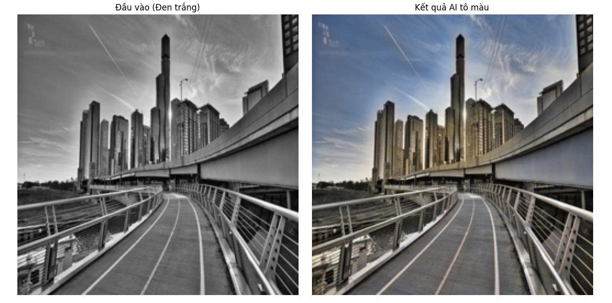

# ImageColorization
Dự án sử dụng Deep Learning (cụ thể là kiến trúc U-Net) để tô màu tự động cho các bức ảnh phong cảnh đen trắng. Mô hình được huấn luyện trên tập dữ liệu Landscape để học cách chuyển đổi từ ảnh Grayscale (Kênh L) sang ảnh màu (Kênh ab trong không gian CIELAB).



##  Tính năng
-  Tự động tô màu ảnh đen trắng bất kỳ.
-  Sử dụng kiến trúc U-Net gọn nhẹ.
-  Xử lý ảnh trong không gian màu Lab.
-  Code được module hóa, dễ đọc, dễ mở rộng.

## Cài đặt

1. Clone dự án về máy:
```bash
git clone [git clone https://github.com/hadat710-hus/ImageColorization.git](git clone https://github.com/hadat710-hus/ImageColorization.git)
cd Image-Colorization

2. Cài đặt các thư viện cần thiết:
pip install -r requirements.txt

## Cách sử dụng

1. Huấn luyện (Training)
python train.py
Model sẽ được lưu thành file colorization_model.pth.

2. Chạy thử (Inference)
Để tô màu cho một bức ảnh bất kỳ:
python inference.py

## Kiến trúc mô hình
Backbone: U-Net (Encoder-Decoder với Skip Connections).

Loss Function: L1 Loss (Mean Absolute Error).

Optimizer: Adam (Learning rate 2e-4).

Input size: 256x256.

## Tác giả
Hà Đức Đạt - [(https://github.com/hadat710-hus)]

Đồ án môn học: Thị giác máy tính (Computer Vision).
